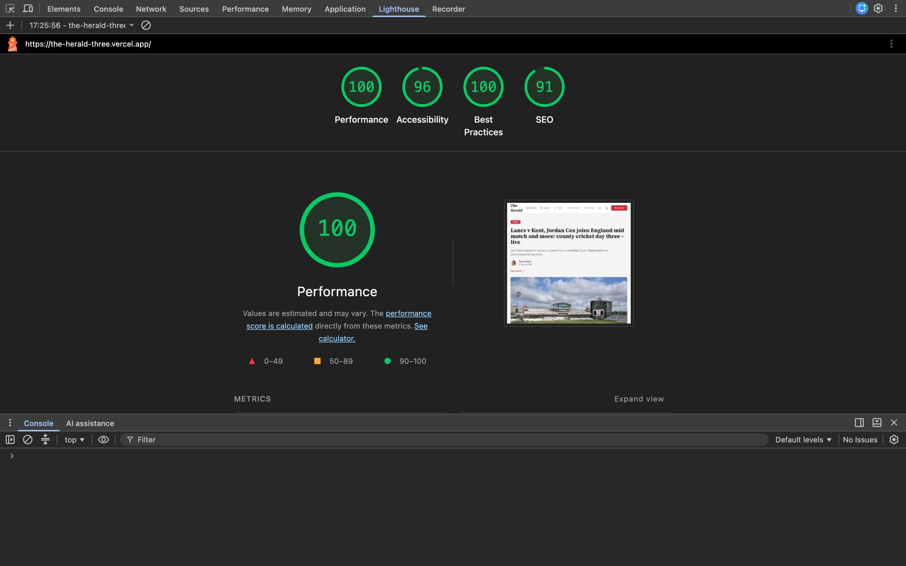

# The Herald

A small, production-quality news website built for the FE take-home assignment. Two pages — a **Home / feed** and an **Article detail** (`/article/[slug]`) — with a design system, light/dark theming, a token-driven gradient backdrop, ISR-backed freshness, skeletons, and lazy loading.

- **Live demo:** <https://the-herald-three.vercel.app/>
- **Figma:** [FE-Assignment](https://www.figma.com/design/FPANdDTccJTwCugq3tpnBi/FE-Assignment?node-id=0-1)
- **Lighthouse (Home):** Performance **100** · Accessibility **100** · Best Practices **100** · SEO **100** — see [Lighthouse](#lighthouse)

---

## Tech stack

| Concern | Choice |
|---|---|
| Framework | **Next.js 16** (App Router, Turbopack) |
| Language | **TypeScript** (strict) |
| UI | **React 19** |
| Styling | **Tailwind CSS v4** with semantic CSS-variable tokens |
| Fonts | `next/font` — **Source Serif 4** (headlines) + **Inter** (UI), self-hosted |
| Data | **Guardian Content API**, with a local JSON fallback |
| Tooling | ESLint (flat) · Prettier · Husky (pre-push) · knip · Vitest |

---

## Quick start

```bash
# 1. Install
npm install

# 2. Configure env (see below) — optional; falls back to mock data
cp .env.example .env.local   # then add your keys

# 3. Run
npm run dev                  # http://localhost:3000
```

### Scripts

| Script | What it does |
|---|---|
| `npm run dev` | Dev server (Turbopack) |
| `npm run build` / `start` | Production build / serve |
| `npm run lint` | ESLint |
| `npm run lint:fix` | ESLint `--fix` + Prettier write |
| `npm run typecheck` | `tsc --noEmit` |
| `npm run test` | Vitest unit tests |
| `npm run knip` | Dead-code / unused-dependency report |

`git push` runs **lint + typecheck** via a Husky pre-push hook.

### Environment variables

| Var | Required | Purpose |
|---|---|---|
| `GUARDIAN_API_KEY` | No* | Guardian Content API key. _Without it, the app serves `src/data/mock-articles.json`._ |
| `REVALIDATE_SECRET` | No | Shared secret for the on-demand revalidation endpoint. |

\* The data source is intentionally swappable — set the key for live news, omit it for the bundled mock feed. Get a free key at <https://open-platform.theguardian.com/access/>.

---

## Architecture & decisions

### Rendering strategy (per page)

| Route | Strategy | Why |
|---|---|---|
| `/` | **Static + ISR** (`revalidate = 60`) | Feed is mostly stable; serve cached HTML, regenerate every 60s. |
| `/article/[slug]` | **SSG + ISR** (`generateStaticParams`, `dynamicParams`, `revalidate = 300`) | Pre-render known articles at build; render unknown slugs on first request, then cache. |
| `/api/revalidate` | **Dynamic** route handler | On-demand cache invalidation (see below). |

### Data layer

`src/lib/data/source.ts` is the single facade (`getHomeFeed`, `getArticle`, `getRelated`). It calls the Guardian client (`src/lib/guardian/`) when `GUARDIAN_API_KEY` is set, and **falls back to `mock-articles.json`** when the key is absent or a request fails — so the UI never breaks. Guardian responses are normalized to a small internal `Article` shape (`src/types/`) by `mappers.ts`, keeping the rest of the app decoupled from the API.

### "Top Stories" freshness — and the trade-off

The feed stays fresh through **ISR with a short revalidate window** plus **on-demand revalidation**:

- Every Guardian fetch is cached with a `revalidate` window (home `60s`, article `300s`) and tagged `"articles"`. Next.js serves cached HTML instantly and regenerates in the background (stale-while-revalidate).
- `POST /api/revalidate?secret=…` purges the `"articles"` tag (and an optional `path`) to push **breaking content immediately**, without waiting for the window.

**Why this over the alternatives:** client-side polling would add request volume and hurt Core Web Vitals; full SSR on every request would raise TTFB and cost. ISR gives static-fast delivery with bounded staleness, and the on-demand hook covers the "publish now" case. Loading state is handled by route-level skeletons (below), so a regenerating page still paints instantly from cache.

### Design system / tokens

Semantic tokens live in `src/app/globals.css` as CSS variables on `:root` and `[data-theme="dark"]`, mapped to Tailwind utilities via `@theme inline` (so `bg-bg`, `text-fg`, `text-accent`, etc. flip with the theme automatically). Tokens cover **color, surfaces, borders, accent, nav, footer, gradient, radius, type, container/prose widths**. Reusable primitives are built on top: `Container`, `Button`, `CategoryBadge`/`CategoryLabel` (Tag), `ArticleCard` (Card), `Byline`, `SectionHeading`, `Skeleton`. Consistency comes from the system — there are no ad-hoc hex values in components.

### Theming (light / dark, no FOUC)

- `data-theme` is written to `<html>` **before first paint** by a tiny inline script (`src/lib/theme/theme-script.ts`) — no flash of the wrong theme.
- Default = the user's **system preference**; a manual toggle **persists to `localStorage`**.
- The toggle reads the live theme via `useSyncExternalStore` (`use-theme.ts`) — no `setState`-in-effect, no hydration mismatch.

### Gradient backdrop (token-driven, theme-aware)

The article hero is a layered **radial-gradient glow** over a near-black base, defined entirely through tokens (`--hero-base`, `--hero-veil`, `--hero-glow-1…4`):

- **Token-driven, not hardcoded** — `.article-hero` composes only `var(--hero-*)`. The light theme uses the Figma values; the **dark theme overrides the same tokens** (lifts the veil, boosts the glows) so it stays vivid against the dark page.
- **Pure CSS** (no image asset) — zero extra network weight and negligible paint/repaint cost vs. a large gradient PNG.
- **Contrast** — hero text is white on a dark base; the veil token keeps the glow muted enough to hold WCAG AA contrast for the title, standfirst, and byline.
- **Degrades gracefully** — percentage-based radial positions reflow across breakpoints; on mobile the hero stacks without clipping.

### Responsiveness & max-width

Content sits in a `1200px` (`--container-max`) centered container; long-form article text is further capped at `680px` (`--prose-max`) for a comfortable reading measure (no edge-to-edge text on wide monitors). Feeds use responsive grids (1 → 2 → 3/4 columns); the masthead collapses to a mobile pill-nav + hamburger drawer.

### Lazy loading

All imagery uses `next/image` (lazy by default, responsive `sizes`, automatic modern formats). Only the LCP images (home hero, article hero) are marked `priority`; everything below the fold loads lazily.

### Skeleton loading (no layout shift)

Route-level `loading.tsx` files create Suspense boundaries: `FeedSkeleton` for `/` and `ArticleSkeleton` for the article page. Skeleton blocks mirror the real layout's dimensions, so swapping in content causes ~0 cumulative layout shift.

### Accessibility

Semantic landmarks (`header`/`main`/`footer`/`nav`), `aria-label`/`aria-current` on navigation, a visible `:focus-visible` ring, descriptive image `alt`, a reduced-motion-safe ticker (`prefers-reduced-motion` freezes it), and contrast-checked tokens in both themes.

### Code quality

Strict TypeScript; ESLint enforces **`import type` / `export type`** (`consistent-type-imports`/`-exports`, mirroring our RN app) and a 100-line-per-file budget; Prettier for formatting; `cn()` uses `tailwind-merge` so passed `className`s reliably override defaults; `knip` guards against dead code; a Husky **pre-push** hook blocks pushes that fail lint or typecheck.

---

## Project structure

```
src/
  app/
    page.tsx                  # Home (Static + ISR)
    loading.tsx               # Home skeleton
    article/[slug]/page.tsx   # Article (SSG + ISR)
    article/[slug]/loading.tsx
    api/revalidate/route.ts   # On-demand ISR
    layout.tsx · globals.css · fonts.ts
  components/
    layout/   # Header, Footer, Nav, MobileMenu, Wordmark, SocialLinks
    home/     # HeroFeature, TopStories, Ticker, EditorsPicks
    article/  # ArticleHero, ArticleBody, Breadcrumb, RelatedList, NewsletterCard
    ui/       # Container, Button, ArticleCard, CategoryBadge/Label, Byline, …
    skeletons/
  lib/        # guardian/ (API client) · data/ (facade) · theme/ · format/ · revalidate/
  types/ · constants/ · data/ (mock JSON)
```

---

## What I'd do with more time

- **Per-section pages** (`/world`, `/tech`, …). Today the nav links share one mixed feed and use `?section=` only to highlight the active item.
- **Search** — the masthead has the affordance, but the query/results flow is not wired.
- **Newsletter** — the signup card validates and confirms locally; it isn't connected to a provider.
- **HTML sanitization** — article bodies render trusted Guardian/mock HTML; an untrusted source would need sanitizing (e.g. DOMPurify) before `dangerouslySetInnerHTML`.
- **Feed pagination / infinite scroll**, author pages, and a richer "Trending" mobile bar from the Figma mobile frames.
- **Tests** — unit coverage exists for slug/mappers/auth; I'd add component and e2e (Playwright) tests.
- **Proper 404 status** for unknown article slugs (currently renders the not-found UI but returns 200 in some on-demand cases — a Next streaming nuance).

---

## Lighthouse

Measured on the deployed production build via PageSpeed Insights / Lighthouse (desktop), <https://the-herald-three.vercel.app/>:

| Page | Performance | Accessibility | Best Practices | SEO |
|---|---|---|---|---|
| **Home** (`/`) | **100** | **100** | **100** | **100** |
| **Article** (`/article/[slug]`) | **100** | **100** | **100** | **100** |



> Article-page screenshot to embed: `docs/lighthouse-article.png` _(scores verified: 100 / 100 / 100 / 100)_.

## Deployment

Deployed on **Vercel**: <https://the-herald-three.vercel.app/>

Set `GUARDIAN_API_KEY` and `REVALIDATE_SECRET` in the Vercel project's environment variables. Pushing to the default branch triggers an automatic build & deploy.
